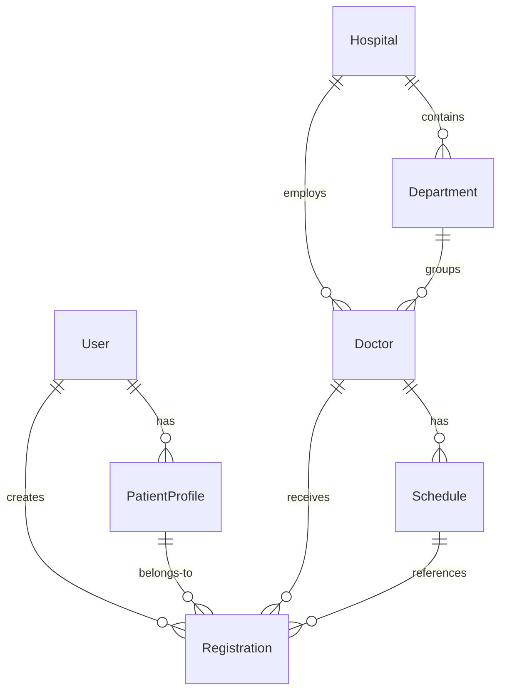
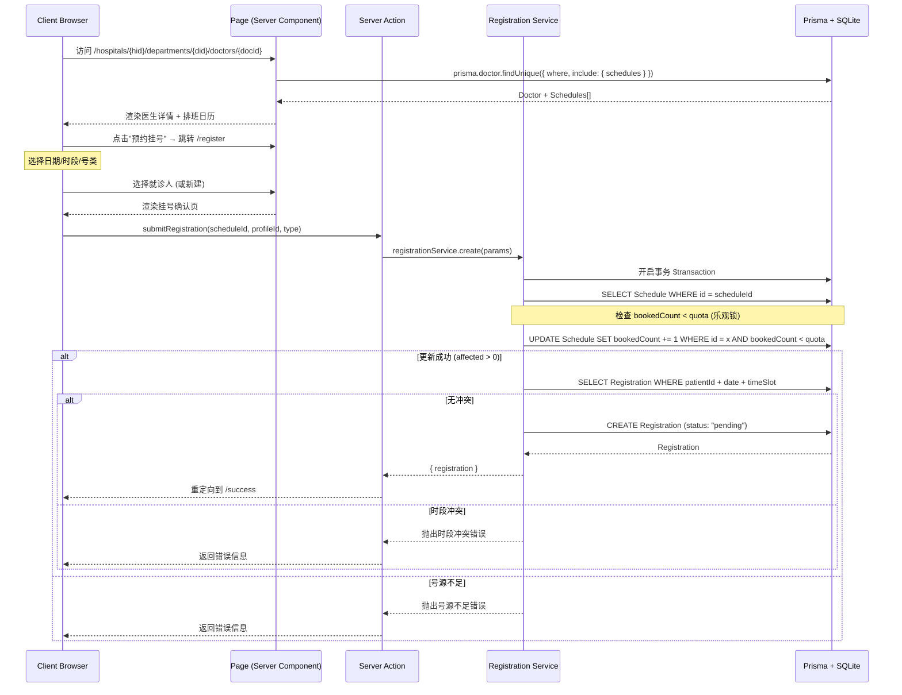
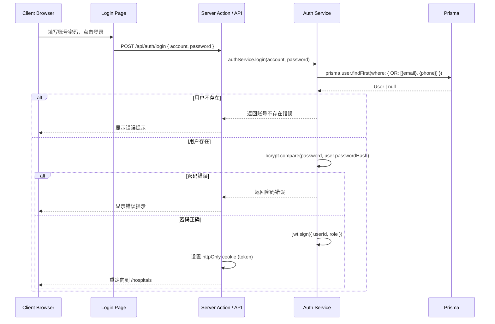
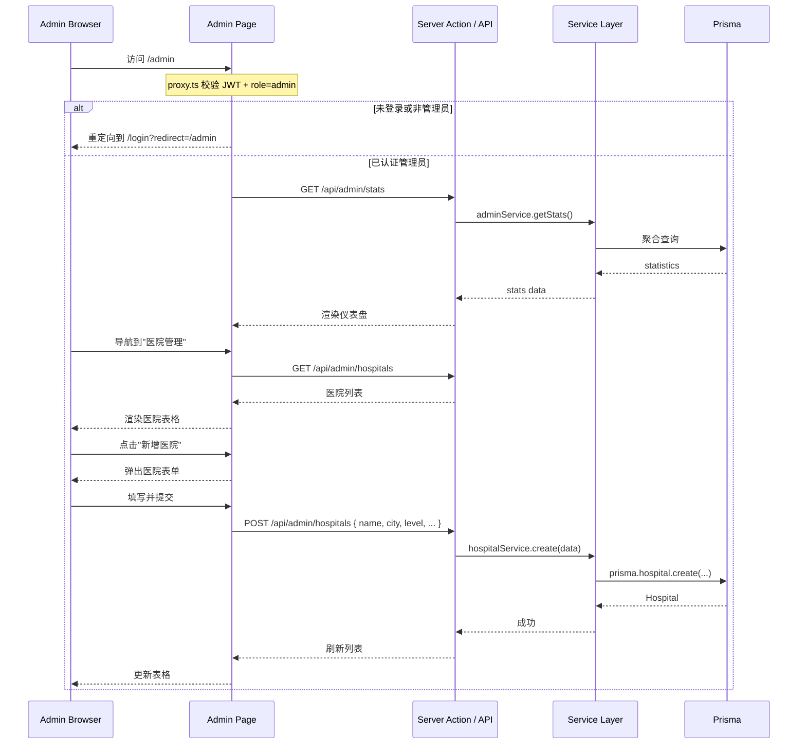
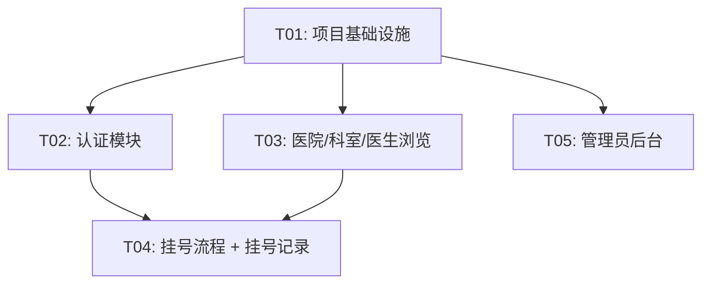

# 医院在线挂号系统 — 架构设计文档

> **版本**: v1.0  
> **架构师**: 高见远 (Bob)  
> **日期**: 2025-07  
> **技术栈**: Next.js 16 + React 19 + TypeScript 6 + Prisma 7 + SQLite + Tailwind CSS 4

---

## 目录

1. [实现方案](#1-实现方案)
2. [路由设计](#2-路由设计)
3. [组件树](#3-组件树)
4. [数据模型](#4-数据模型)
5. [API 接口设计](#5-api-接口设计)
6. [程序调用流程](#6-程序调用流程)
7. [文件列表](#7-文件列表)
8. [任务列表](#8-任务列表)
9. [依赖包列表](#9-依赖包列表)
10. [共享知识](#10-共享知识)
11. [待明确事项](#11-待明确事项)

---

## 1. 实现方案

### 1.1 核心技术挑战

| 挑战             | 应对策略                                                                                        |
| ---------------- | ----------------------------------------------------------------------------------------------- |
| **号源并发超卖** | 使用 Prisma 事务 + 乐观锁（`bookedCount < quota` 条件更新），确保同一时刻只有一个请求能扣减号源 |
| **预约时段冲突** | 挂号前检查同一患者在同一时段是否已有挂号记录                                                    |
| **JWT 会话安全** | httpOnly cookie 存储 token，Server Component 通过 `cookies()` API 读取，API Route 校验中间件    |
| **响应式布局**   | Tailwind CSS 断点体系 + 移动优先设计                                                            |

### 1.2 架构模式

采用 **分层架构 + App Router 文件系统路由**：

```
┌─────────────────────────────────────┐
│          Presentation Layer          │
│   (React Server/Client Components)  │
├─────────────────────────────────────┤
│          Application Layer           │
│   (Server Actions / API Routes)      │
├─────────────────────────────────────┤
│           Service Layer              │
│   (lib/services - 业务逻辑封装)       │
├─────────────────────────────────────┤
│           Data Access Layer          │
│   (lib/db - Prisma Client)           │
├─────────────────────────────────────┤
│            Data Store                │
│   (SQLite via Prisma)               │
└─────────────────────────────────────┘
```

### 1.3 技术选型及理由

| 技术             | 版本   | 说明                                          |
| ---------------- | ------ | --------------------------------------------- |
| **Next.js**      | 16.2.6 | App Router, Server Components, Server Actions |
| **React**        | 19.2.4 | RSC, Server Functions, View Transitions       |
| **TypeScript**   | 6.x    | 类型安全                                      |
| **Prisma**       | 7.8.0  | ORM, 迁移, 类型生成                           |
| **SQLite**       | (内置) | 本地开发/单机部署, 零配置                     |
| **Tailwind CSS** | 4.x    | 原子化 CSS, 响应式设计                        |
| **bcryptjs**     | —      | 密码哈希                                      |
| **jsonwebtoken** | —      | JWT 签发与验证                                |
| **zod**          | —      | 请求校验 schema                               |
| **date-fns**     | —      | 日期格式化与计算                              |

### 1.4 Next.js 16 Breaking Changes 影响分析

经阅读 Next.js 16 升级文档，以下变更与本项目相关：

| 变更                                     | 影响                                              | 应对                                                   |
| ---------------------------------------- | ------------------------------------------------- | ------------------------------------------------------ |
| **Async Request APIs** (Breaking)        | `params`, `searchParams` 必须 `await`             | 所有 page/layout/route 组件中使用 `await props.params` |
| **middleware → proxy**                   | 中间件文件名改为 `proxy.ts`，导出函数改为 `proxy` | 使用 `src/proxy.ts` 替代 `middleware.ts`               |
| **Turbopack 默认**                       | `next dev`/`next build` 默认使用 Turbopack        | 无需额外配置，已有的 `reactCompiler: true` 稳定可用    |
| **`next lint` 移除**                     | 使用 ESLint CLI 直接运行                          | `npx eslint .` 替代 `next lint`                        |
| **运行时配置移除**                       | `serverRuntimeConfig`/`publicRuntimeConfig` 删除  | 改用环境变量或 `process.env`                           |
| **Parallel Routes require `default.js`** | 所有 parallel route slot 必须有 `default.js`      | 本设计不使用 parallel routes，无影响                   |

---

## 2. 路由设计

### 2.1 App Router 路由结构

```
src/app/
├── (public)/                          # 公共页面布局（带导航）
│   ├── layout.tsx                     # 公共布局（头部导航 + 底部）
│   ├── page.tsx                       # 首页 / 引导页
│   ├── hospitals/
│   │   ├── page.tsx                   # 医院列表页（筛选 + 搜索）
│   │   └── [hospitalId]/
│   │       ├── page.tsx               # 医院详情页（展示科室列表）
│   │       └── departments/
│   │           └── [departmentId]/
│   │               ├── page.tsx       # 科室详情页（展示医生列表）
│   │               └── doctors/
│   │                   └── [doctorId]/
│   │                       ├── page.tsx           # 医生详情页（排班 + 号源）
│   │                       └── register/
│   │                           ├── page.tsx       # 号源选择 / 预约页
│   │                           └── confirm/
│   │                               └── page.tsx   # 挂号确认页
│   └── appointments/
│       ├── page.tsx                   # 挂号记录列表
│       └── [id]/
│           └── page.tsx               # 挂号详情页
├── (auth)/                            # 认证页面布局（简洁）
│   ├── layout.tsx                     # 认证布局（无导航）
│   ├── login/
│   │   └── page.tsx                   # 登录页
│   └── register/
│       └── page.tsx                   # 注册页
├── admin/                             # 管理员后台
│   ├── layout.tsx                     # 后台布局（侧边栏）
│   ├── page.tsx                       # 后台首页（挂号总览仪表盘）
│   ├── hospitals/
│   │   └── page.tsx                   # 医院管理
│   ├── departments/
│   │   └── page.tsx                   # 科室管理
│   ├── doctors/
│   │   └── page.tsx                   # 医生管理
│   └── schedules/
│       └── page.tsx                   # 排班管理
├── api/                               # API 路由
│   ├── auth/
│   │   ├── register/route.ts          # POST 注册
│   │   ├── login/route.ts             # POST 登录
│   │   └── logout/route.ts            # POST 登出
│   ├── hospitals/
│   │   ├── route.ts                   # GET 医院列表
│   │   └── [hospitalId]/
│   │       ├── route.ts               # GET 医院详情
│   │       └── departments/
│   │           ├── route.ts           # GET 科室列表
│   │           └── [departmentId]/
│   │               ├── route.ts       # GET 科室详情
│   │               └── doctors/
│   │                   ├── route.ts   # GET 医生列表
│   │                   └── [doctorId]/
│   │                       ├── route.ts           # GET 医生详情
│   │                       └── schedules/
│   │                           └── route.ts       # GET 排班 + 号源
│   ├── appointments/
│   │   ├── route.ts                   # GET 挂号记录 / POST 新建挂号
│   │   └── [id]/
│   │       ├── route.ts               # GET 挂号详情
│   │       └── cancel/route.ts        # POST 取消挂号
│   └── admin/
│       ├── hospitals/
│       │   ├── route.ts               # GET/POST 医院
│       │   └── [hospitalId]/
│       │       ├── route.ts           # GET/PUT/DELETE 医院
│       │       └── departments/
│       │           ├── route.ts       # GET/POST 科室
│       │           └── [departmentId]/
│       │               ├── route.ts   # GET/PUT/DELETE 科室
│       │               └── doctors/
│       │                   ├── route.ts           # GET/POST 医生
│       │                   └── [doctorId]/
│       │                       ├── route.ts       # GET/PUT/DELETE 医生
│       │                       └── schedules/
│       │                           ├── route.ts   # GET/POST 排班
│       │                           └── [scheduleId]/
│       │                               └── route.ts # GET/PUT/DELETE 排班
│       └── stats/route.ts             # GET 挂号统计
├── layout.tsx                         # 根布局
├── globals.css                        # 全局样式
├── not-found.tsx                      # 404 页面
└── error.tsx                          # 错误页面
```

### 2.2 路由守护策略

```
src/proxy.ts  (Next.js 16 proxy 替代 middleware)
├── /admin/*  → 验证 JWT + role=admin，否则重定向到 /login
├── /api/admin/* → 验证 JWT + role=admin，否则返回 401
└── /api/appointments/*  → 验证 JWT，否则返回 401
```

> **注意**: 根据 Next.js 16 Breaking Change，已弃用 `middleware.ts`，改用 `proxy.ts`，导出函数名为 `proxy`。

---

## 3. 组件树

### 3.1 前端组件层级

```
src/
├── components/
│   ├── ui/                          # 通用 UI 组件
│   │   ├── Button.tsx               # 按钮组件
│   │   ├── Card.tsx                 # 卡片组件
│   │   ├── Input.tsx                # 输入框组件
│   │   ├── Select.tsx               # 下拉选择器
│   │   ├── Badge.tsx                # 标签
│   │   ├── Modal.tsx                # 模态框
│   │   ├── Pagination.tsx           # 分页
│   │   ├── Loading.tsx              # 加载态
│   │   ├── Empty.tsx                # 空状态
│   │   └── Skeleton.tsx             # 骨架屏
│   ├── layout/                      # 布局组件
│   │   ├── Header.tsx               # 公共头部导航
│   │   ├── Footer.tsx               # 公共底部
│   │   ├── AdminSidebar.tsx         # 管理后台侧边栏
│   │   └── AdminHeader.tsx          # 管理后台顶部栏
│   ├── auth/                        # 认证组件
│   │   ├── LoginForm.tsx            # 登录表单
│   │   └── RegisterForm.tsx         # 注册表单
│   ├── hospital/                    # 医院相关组件
│   │   ├── HospitalCard.tsx         # 医院卡片
│   │   ├── HospitalFilter.tsx       # 筛选栏
│   │   ├── HospitalSearch.tsx       # 医院搜索
│   │   └── HospitalInfo.tsx         # 医院详情信息
│   ├── department/                  # 科室相关组件
│   │   ├── DepartmentCard.tsx       # 科室卡片
│   │   └── DepartmentList.tsx       # 科室列表
│   ├── doctor/                      # 医生相关组件
│   │   ├── DoctorCard.tsx           # 医生卡片
│   │   ├── DoctorInfo.tsx           # 医生详情
│   │   └── ScheduleCalendar.tsx     # 排班日历（7天）
│   ├── appointment/                 # 挂号相关组件
│   │   ├── SlotSelector.tsx         # 号源选择器
│   │   ├── PatientSelector.tsx      # 就诊人选择器
│   │   ├── PatientForm.tsx          # 就诊人表单
│   │   ├── ConfirmCard.tsx          # 确认信息卡片
│   │   ├── SuccessCard.tsx          # 挂号成功卡片
│   │   └── AppointmentList.tsx      # 挂号记录列表
│   └── admin/                       # 管理后台组件
│       ├── DataTable.tsx            # 通用数据表格
│       ├── HospitalForm.tsx         # 医院表单
│       ├── DepartmentForm.tsx       # 科室表单
│       ├── DoctorForm.tsx           # 医生表单
│       └── ScheduleForm.tsx         # 排班表单
├── lib/                             # 工具库
│   ├── db/
│   │   └── index.ts                 # Prisma Client 单例
│   ├── services/                    # 业务服务层
│   │   ├── auth.service.ts          # 认证服务
│   │   ├── hospital.service.ts      # 医院服务
│   │   ├── department.service.ts    # 科室服务
│   │   ├── doctor.service.ts        # 医生服务
│   │   ├── schedule.service.ts      # 排班服务
│   │   └── registration.service.ts  # 挂号服务
│   ├── utils/
│   │   ├── jwt.ts                   # JWT 工具
│   │   ├── password.ts              # 密码工具
│   │   ├── errors.ts                # 错误类定义
│   │   └── response.ts             # API 响应辅助
│   └── validations/                 # Zod schemas
│       ├── auth.schema.ts
│       ├── hospital.schema.ts
│       ├── department.schema.ts
│       ├── doctor.schema.ts
│       └── registration.schema.ts
└── types/                           # 类型定义
    ├── index.ts                     # 核心类型
    ├── api.ts                       # API 请求/响应类型
    └── next.ts                      # Next.js 扩展类型
```

---

## 4. 数据模型

### 4.1 Prisma Schema

```prisma
generator client {
  provider = "prisma-client"
  output   = "../generated/prisma"
}

datasource db {
  provider = "sqlite"
}

// ─── 用户 ────────────────────────────────────────────
model User {
  id           String   @id @default(cuid())
  name         String
  email        String?  @unique
  phone        String?  @unique
  passwordHash String
  role         String   @default("patient") // "patient" | "admin"
  createdAt    DateTime @default(now())

  patientProfiles PatientProfile[]
  registrations   Registration[]

  @@index([email])
  @@index([phone])
}

// ─── 就诊人 ──────────────────────────────────────────
model PatientProfile {
  id     String @id @default(cuid())
  userId String
  name   String
  idCard String // 身份证号
  phone  String
  gender String // "male" | "female"

  user   User   @relation(fields: [userId], references: [id], onDelete: Cascade)
  registrations Registration[]

  @@index([userId])
}

// ─── 医院 ────────────────────────────────────────────
model Hospital {
  id          String   @id @default(cuid())
  name        String
  address     String
  city        String
  level       String   // "三甲" | "三乙" | "二甲" | "二乙" | "一级"
  phone       String
  description String   @default("")
  imageUrl    String   @default("")
  createdAt   DateTime @default(now())

  departments Department[]
  doctors     Doctor[]

  @@index([city])
  @@index([level])
}

// ─── 科室 ────────────────────────────────────────────
model Department {
  id          String   @id @default(cuid())
  name        String
  description String   @default("")
  hospitalId  String

  hospital Hospital @relation(fields: [hospitalId], references: [id], onDelete: Cascade)
  doctors  Doctor[]

  @@index([hospitalId])
  @@unique([name, hospitalId])
}

// ─── 医生 ────────────────────────────────────────────
model Doctor {
  id           String   @id @default(cuid())
  name         String
  title        String   // "主任医师" | "副主任医师" | "主治医师" | "住院医师"
  specialty    String   // 专长
  introduction String   @default("")
  avatarUrl    String   @default("")
  departmentId String
  hospitalId   String

  department    Department    @relation(fields: [departmentId], references: [id], onDelete: Cascade)
  hospital      Hospital      @relation(fields: [hospitalId], references: [id])
  schedules     Schedule[]
  registrations Registration[]

  @@index([departmentId])
  @@index([hospitalId])
  @@index([name])
}

// ─── 排班 ────────────────────────────────────────────
model Schedule {
  id          String   @id @default(cuid())
  doctorId    String
  date        String   // "2025-07-15" ISO date
  timeSlot    String   // "am" | "pm" | "evening"
  quota       Int      // 总号源数
  bookedCount Int      @default(0) // 已预约数
  type        String   @default("normal") // "normal" 普通 | "expert" 专家 | "special" 特需
  createdAt   DateTime @default(now())

  doctor        Doctor         @relation(fields: [doctorId], references: [id], onDelete: Cascade)
  registrations Registration[]

  @@unique([doctorId, date, timeSlot, type])
  @@index([doctorId, date])
  @@index([date])
}

// ─── 挂号记录 ────────────────────────────────────────
model Registration {
  id          String   @id @default(cuid())
  patientId   String   // User.id (患者)
  profileId   String   // PatientProfile.id (就诊人)
  doctorId    String
  scheduleId  String
  date        String   // 就诊日期
  timeSlot    String   // "am" | "pm" | "evening"
  type        String   // "normal" | "expert" | "special"
  status      String   @default("pending") // "pending" 待就诊 | "done" 已就诊 | "cancelled" 已取消
  createdAt   DateTime @default(now())

  patient  User     @relation(fields: [patientId], references: [id])
  profile  PatientProfile @relation(fields: [profileId], references: [id])
  doctor   Doctor   @relation(fields: [doctorId], references: [id])
  schedule Schedule @relation(fields: [scheduleId], references: [id])

  @@index([patientId])
  @@index([doctorId])
  @@index([scheduleId])
  @@index([date])
  @@index([patientId, date, timeSlot]) // 用于冲突检测
}
```

### 4.2 实体关系图



---

## 5. API 接口设计

### 5.1 统一格式

所有 API 响应使用统一格式：

```typescript
// 成功
{
  "code": 0,
  "data": { ... },
  "message": "ok"
}

// 错误
{
  "code": 40001,
  "data": null,
  "message": "具体的错误描述"
}
```

### 5.2 认证 API

#### `POST /api/auth/register`

注册新用户。

```
请求体:
{
  "name": string,        // 用户名
  "email"?: string,      // 邮箱（与 phone 至少一个）
  "phone"?: string,      // 手机号（与 email 至少一个）
  "password": string     // 密码（≥6位）
}
响应: { code: 0, data: { user: { id, name, email, phone, role } }, message: "ok" }
行为: 注册成功后自动设置 httpOnly cookie (token)
```

#### `POST /api/auth/login`

用户登录。

```
请求体:
{
  "account": string,    // 邮箱或手机号
  "password": string
}
响应: { code: 0, data: { user: { id, name, email, phone, role } }, message: "ok" }
行为: 成功后设置 httpOnly cookie (token)
```

#### `POST /api/auth/logout`

用户登出。

```
响应: { code: 0, data: null, message: "ok" }
行为: 清除 httpOnly cookie
```

### 5.3 医院 API

#### `GET /api/hospitals`

获取医院列表。

```
查询参数:
  ?city=string        // 按城市筛选
  &level=string       // 按等级筛选 ("三甲"|"二甲"|...)
  &keyword=string     // 按名称模糊搜索
  &page=number        // 页码，默认 1
  &pageSize=number    // 每页条数，默认 10
响应: { code: 0, data: { list: Hospital[], total: number, page: number, pageSize: number } }
```

#### `GET /api/hospitals/[hospitalId]`

获取医院详情。

```
响应: { code: 0, data: Hospital & { departmentCount: number, doctorCount: number } }
```

#### `GET /api/hospitals/[hospitalId]/departments`

获取科室列表。

```
响应: { code: 0, data: Department[] & { doctorCount: number }[] }
```

#### `GET /api/hospitals/departments/[departmentId]`

获取科室详情 + 医生列表。

```
响应: { code: 0, data: { department: Department, doctors: Doctor[] } }
```

#### `GET /api/hospitals/departments/[departmentId]/doctors`

获取科室下医生列表。

```
响应: { code: 0, data: Doctor[] }
```

#### `GET /api/hospitals/departments/doctors/[doctorId]`

获取医生详情。

```
响应: { code: 0, data: Doctor & { department: Department, hospital: Hospital } }
```

#### `GET /api/hospitals/departments/doctors/[doctorId]/schedules`

获取医生未来 7 天排班。

```
查询参数:
  ?startDate=string   // 起始日期 (YYYY-MM-DD)，默认为今天
  &endDate=string     // 结束日期，默认为 7 天后
响应: {
  code: 0,
  data: Schedule[]  // 每个元素包含剩余号数 (quota - bookedCount)
}
```

### 5.4 挂号 API

#### `GET /api/appointments`

获取当前用户的挂号记录列表。

```
查询参数:
  ?status=string      // 筛选状态 "pending"|"done"|"cancelled"
  &page=number
  &pageSize=number
响应: { code: 0, data: { list: RegistrationWithDetail[], total: number } }
```

#### `POST /api/appointments`

提交挂号。

```
请求体:
{
  "scheduleId": string,      // 排班 ID
  "profileId": string,       // 就诊人 ID
  "type": string             // "normal" | "expert" | "special"
}
响应: { code: 0, data: { registration: Registration } }
行为:
  1. 使用 Prisma 事务
  2. 检查 Schedule.bookedCount < Schedule.quota
  3. 检查该患者在同一日期+时段无冲突
  4. 递增 bookedCount
  5. 创建 Registration 记录
  6. 任一失败则回滚
```

#### `GET /api/appointments/[id]`

获取挂号详情。

```
响应: { code: 0, data: RegistrationWithDetail }
```

#### `POST /api/appointments/[id]/cancel`

取消挂号。

```
请求体:
{
  "reason"?: string
}
响应: { code: 0, data: { registration: Registration } }
行为:
  1. 检查 status === "pending"
  2. 检查当前时间距就诊时间 > 2 小时（P1）
  3. 事务: 递减 Schedule.bookedCount, 设置 status="cancelled"
```

### 5.5 就诊人 API（P1）

#### `GET /api/patient-profiles`

获取当前用户的所有就诊人。

```
响应: { code: 0, data: PatientProfile[] }
```

#### `POST /api/patient-profiles`

新增就诊人。

```
请求体:
{
  "name": string,
  "idCard": string,
  "phone": string,
  "gender": "male" | "female"
}
响应: { code: 0, data: { profile: PatientProfile } }
```

### 5.6 管理员 API

#### `GET /api/admin/stats`

获取挂号统计总览。

```
响应: {
  code: 0,
  data: {
    todayAppointments: number,
    totalHospitals: number,
    totalDoctors: number,
    departmentDistribution: { departmentName: string, count: number }[]
  }
}
```

#### 医院 CRUD

```
GET    /api/admin/hospitals              → 列表 (支持分页)
POST   /api/admin/hospitals              → 新建
GET    /api/admin/hospitals/[id]         → 详情
PUT    /api/admin/hospitals/[id]         → 更新
DELETE /api/admin/hospitals/[id]         → 删除
```

#### 科室 CRUD

```
GET    /api/admin/hospitals/[hospitalId]/departments              → 列表
POST   /api/admin/hospitals/[hospitalId]/departments              → 新建
GET    /api/admin/departments/[id]                                → 详情
PUT    /api/admin/departments/[id]                                → 更新
DELETE /api/admin/departments/[id]                                → 删除
```

#### 医生 CRUD

```
GET    /api/admin/departments/[deptId]/doctors              → 列表
POST   /api/admin/departments/[deptId]/doctors              → 新建 (含 hospitalId)
GET    /api/admin/doctors/[id]                              → 详情
PUT    /api/admin/doctors/[id]                              → 更新
DELETE /api/admin/doctors/[id]                              → 删除
```

#### 排班 CRUD

```
GET    /api/admin/doctors/[doctorId]/schedules               → 列表 (按日期排序)
POST   /api/admin/doctors/[doctorId]/schedules               → 新建
GET    /api/admin/schedules/[id]                             → 详情
PUT    /api/admin/schedules/[id]                             → 更新
DELETE /api/admin/schedules/[id]                             → 删除
```

---

## 6. 程序调用流程

### 6.1 用户挂号流程



### 6.2 用户登录流程



### 6.3 管理员后台流程



---

## 7. 文件列表

### 7.1 配置文件（根目录）

```
prisma/schema.prisma              # Prisma 数据模型定义
prisma/seed.ts                    # 种子数据：默认管理员 + 演示数据
next.config.ts                    # Next.js 配置（已有 reactCompiler: true）
tsconfig.json                     # TypeScript 配置（已有 @/ 别名）
package.json                      # 依赖声明
postcss.config.mjs                # PostCSS 配置（Tailwind）
eslint.config.mjs                 # ESLint 配置
```

### 7.2 源文件（src/）

```
# ─── 入口 ───
src/app/layout.tsx               # 根布局 (已有，需修改)
src/app/globals.css               # 全局样式 (已有，需修改)
src/app/page.tsx                  # 首页 (已有，需重写)
src/app/not-found.tsx             # 404 页面
src/app/error.tsx                 # 错误页面

# ─── 认证模块 ───
src/app/(auth)/layout.tsx         # 认证页面布局（简洁，无导航）
src/app/(auth)/login/page.tsx     # 登录页
src/app/(auth)/register/page.tsx  # 注册页
src/app/api/auth/register/route.ts # 注册 API
src/app/api/auth/login/route.ts    # 登录 API
src/app/api/auth/logout/route.ts   # 登出 API

# ─── 公共页面 ───
src/app/(public)/layout.tsx       # 公共布局（Header + Footer）
src/app/(public)/page.tsx         # 公共首页（重定向到 hospitals）
src/app/(public)/hospitals/page.tsx   # 医院列表页
src/app/(public)/hospitals/[hospitalId]/page.tsx   # 医院详情页
src/app/(public)/hospitals/[hospitalId]/departments/[departmentId]/page.tsx             # 科室详情页
src/app/(public)/hospitals/[hospitalId]/departments/[departmentId]/doctors/[doctorId]/page.tsx  # 医生详情页
src/app/(public)/hospitals/[hospitalId]/departments/[departmentId]/doctors/[doctorId]/register/page.tsx  # 号源选择页
src/app/(public)/hospitals/[hospitalId]/departments/[departmentId]/doctors/[doctorId]/register/confirm/page.tsx  # 确认页

# ─── 挂号记录模块 ───
src/app/(public)/appointments/page.tsx              # 挂号记录列表
src/app/(public)/appointments/[id]/page.tsx         # 挂号详情

# ─── 挂号 API ───
src/app/api/appointments/route.ts                   # GET 列表 / POST 新建
src/app/api/appointments/[id]/route.ts              # GET 详情
src/app/api/appointments/[id]/cancel/route.ts       # POST 取消

# ─── 医院/科室/医生 API ───
src/app/api/hospitals/route.ts                      # GET 列表
src/app/api/hospitals/[hospitalId]/route.ts         # GET 详情
src/app/api/hospitals/[hospitalId]/departments/route.ts           # GET 科室列表
src/app/api/hospitals/departments/[departmentId]/route.ts        # GET 科室详情
src/app/api/hospitals/departments/[departmentId]/doctors/route.ts # GET 医生列表
src/app/api/hospitals/departments/doctors/[doctorId]/route.ts    # GET 医生详情
src/app/api/hospitals/departments/doctors/[doctorId]/schedules/route.ts  # GET 排班

# ─── 就诊人 API ───
src/app/api/patient-profiles/route.ts               # GET 列表 / POST 新建

# ─── 管理员后台 ───
src/app/admin/layout.tsx                            # 后台布局
src/app/admin/page.tsx                              # 后台首页（仪表盘）
src/app/admin/hospitals/page.tsx                    # 医院管理
src/app/admin/departments/page.tsx                  # 科室管理
src/app/admin/doctors/page.tsx                      # 医生管理
src/app/admin/schedules/page.tsx                    # 排班管理

# ─── 管理员 API ───
src/app/api/admin/stats/route.ts                    # 统计
src/app/api/admin/hospitals/route.ts                # 医院 CRUD 列表/新建
src/app/api/admin/hospitals/[hospitalId]/route.ts   # 医院 CRUD 单条
src/app/api/admin/hospitals/[hospitalId]/departments/route.ts  # 科室 CRUD 列表/新建
src/app/api/admin/departments/[id]/route.ts         # 科室 CRUD 单条
src/app/api/admin/departments/[deptId]/doctors/route.ts       # 医生 CRUD 列表/新建
src/app/api/admin/doctors/[id]/route.ts             # 医生 CRUD 单条
src/app/api/admin/doctors/[doctorId]/schedules/route.ts      # 排班 CRUD 列表/新建
src/app/api/admin/schedules/[id]/route.ts           # 排班 CRUD 单条

# ─── 中间件 ───
src/proxy.ts                                        # 路由守护（替代 middleware.ts）

# ─── UI 组件 ───
src/components/ui/Button.tsx
src/components/ui/Card.tsx
src/components/ui/Input.tsx
src/components/ui/Select.tsx
src/components/ui/Badge.tsx
src/components/ui/Modal.tsx
src/components/ui/Pagination.tsx
src/components/ui/Loading.tsx
src/components/ui/Empty.tsx
src/components/ui/Skeleton.tsx

# ─── 布局组件 ───
src/components/layout/Header.tsx
src/components/layout/Footer.tsx
src/components/layout/AdminSidebar.tsx
src/components/layout/AdminHeader.tsx

# ─── 业务组件 ───
src/components/auth/LoginForm.tsx
src/components/auth/RegisterForm.tsx
src/components/hospital/HospitalCard.tsx
src/components/hospital/HospitalFilter.tsx
src/components/hospital/HospitalSearch.tsx
src/components/hospital/HospitalInfo.tsx
src/components/department/DepartmentCard.tsx
src/components/department/DepartmentList.tsx
src/components/doctor/DoctorCard.tsx
src/components/doctor/DoctorInfo.tsx
src/components/doctor/ScheduleCalendar.tsx
src/components/appointment/SlotSelector.tsx
src/components/appointment/PatientSelector.tsx
src/components/appointment/PatientForm.tsx
src/components/appointment/ConfirmCard.tsx
src/components/appointment/SuccessCard.tsx
src/components/appointment/AppointmentList.tsx

# ─── 管理后台组件 ───
src/components/admin/DataTable.tsx
src/components/admin/HospitalForm.tsx
src/components/admin/DepartmentForm.tsx
src/components/admin/DoctorForm.tsx
src/components/admin/ScheduleForm.tsx

# ─── 库 ───
src/lib/db/index.ts                # Prisma Client 单例
src/lib/services/auth.service.ts
src/lib/services/hospital.service.ts
src/lib/services/department.service.ts
src/lib/services/doctor.service.ts
src/lib/services/schedule.service.ts
src/lib/services/registration.service.ts
src/lib/utils/jwt.ts
src/lib/utils/password.ts
src/lib/utils/errors.ts
src/lib/utils/response.ts
src/lib/validations/auth.schema.ts
src/lib/validations/hospital.schema.ts
src/lib/validations/department.schema.ts
src/lib/validations/doctor.schema.ts
src/lib/validations/registration.schema.ts

# ─── 类型定义 ───
src/types/index.ts
src/types/api.ts
src/types/next.ts
```

---

## 8. 任务列表

### T01: 项目基础设施

| 字段         | 内容                                                            |
| ------------ | --------------------------------------------------------------- |
| **任务 ID**  | T01                                                             |
| **任务名称** | 项目基础设施 — 配置文件 + Prisma Schema + 种子数据 + 核心工具库 |
| **优先级**   | P0                                                              |
| **依赖**     | 无                                                              |

**需创建/修改的文件：**

```
prisma/schema.prisma         # 完整数据模型定义（含所有实体、关系、索引）
prisma/seed.ts               # 种子数据：默认管理员、演示医院/科室/医生/排班
next.config.ts               # 确认配置（已有 reactCompiler: true）
src/lib/db/index.ts          # Prisma Client 单例
src/lib/utils/jwt.ts         # JWT 签发与验证工具
src/lib/utils/password.ts    # bcrypt 哈希与比对工具
src/lib/utils/errors.ts      # 自定义错误类（AppError, AuthError, NotFoundError 等）
src/lib/utils/response.ts    # API 统一响应格式 { code, data, message }
src/proxy.ts                 # 路由守护（JWT 验证 + 角色鉴权）
src/types/index.ts           # 核心类型定义
src/types/api.ts             # API 请求/响应类型
src/types/next.ts            # Next.js 类型扩展
```

### T02: 认证模块 + 就诊人管理

| 字段         | 内容                                        |
| ------------ | ------------------------------------------- |
| **任务 ID**  | T02                                         |
| **任务名称** | 认证模块 — 注册/登录/登出 + UI + 就诊人管理 |
| **优先级**   | P0                                          |
| **依赖**     | T01                                         |

**需创建/修改的文件：**

```
src/app/(auth)/layout.tsx
src/app/(auth)/login/page.tsx
src/app/(auth)/register/page.tsx
src/components/auth/LoginForm.tsx
src/components/auth/RegisterForm.tsx
src/app/api/auth/register/route.ts
src/app/api/auth/login/route.ts
src/app/api/auth/logout/route.ts
src/lib/services/auth.service.ts
src/lib/validations/auth.schema.ts
src/app/api/patient-profiles/route.ts       # P1 就诊人 CRUD
src/components/appointment/PatientForm.tsx  # 就诊人表单
src/components/appointment/PatientSelector.tsx
```

### T03: 医院/科室/医生浏览 + 公共布局

| 字段         | 内容                                                |
| ------------ | --------------------------------------------------- |
| **任务 ID**  | T03                                                 |
| **任务名称** | 医院/科室/医生浏览功能 — 公共布局 + 列表/详情 + API |
| **优先级**   | P0                                                  |
| **依赖**     | T01                                                 |

**需创建/修改的文件：**

```
src/app/globals.css                          # 修改全局样式
src/app/layout.tsx                           # 修改根布局
src/app/(public)/layout.tsx                  # 公共布局（Header + Footer）
src/app/(public)/page.tsx                    # 公共首页重定向
src/components/layout/Header.tsx
src/components/layout/Footer.tsx
src/app/(public)/hospitals/page.tsx
src/app/(public)/hospitals/[hospitalId]/page.tsx
src/app/(public)/hospitals/[hospitalId]/departments/[departmentId]/page.tsx
src/app/(public)/hospitals/[hospitalId]/departments/[departmentId]/doctors/[doctorId]/page.tsx
src/components/hospital/HospitalCard.tsx
src/components/hospital/HospitalFilter.tsx
src/components/hospital/HospitalSearch.tsx
src/components/hospital/HospitalInfo.tsx
src/components/department/DepartmentCard.tsx
src/components/department/DepartmentList.tsx
src/components/doctor/DoctorCard.tsx
src/components/doctor/DoctorInfo.tsx
src/components/doctor/ScheduleCalendar.tsx
src/app/api/hospitals/route.ts
src/app/api/hospitals/[hospitalId]/route.ts
src/app/api/hospitals/[hospitalId]/departments/route.ts
src/app/api/hospitals/departments/[departmentId]/route.ts
src/app/api/hospitals/departments/[departmentId]/doctors/route.ts
src/app/api/hospitals/departments/doctors/[doctorId]/route.ts
src/app/api/hospitals/departments/doctors/[doctorId]/schedules/route.ts
src/lib/services/hospital.service.ts
src/lib/services/department.service.ts
src/lib/services/doctor.service.ts
src/lib/services/schedule.service.ts
src/lib/validations/hospital.schema.ts
src/lib/validations/department.schema.ts
src/lib/validations/doctor.schema.ts
```

### T04: 挂号流程 + 挂号记录

| 字段         | 内容                                         |
| ------------ | -------------------------------------------- |
| **任务 ID**  | T04                                          |
| **任务名称** | 挂号核心流程 — 号源选择/确认/提交 + 挂号记录 |
| **优先级**   | P0                                           |
| **依赖**     | T02, T03                                     |

**需创建/修改的文件：**

```
src/app/(public)/hospitals/[hospitalId]/departments/[departmentId]/doctors/[doctorId]/register/page.tsx
src/app/(public)/hospitals/[hospitalId]/departments/[departmentId]/doctors/[doctorId]/register/confirm/page.tsx
src/app/(public)/appointments/page.tsx
src/app/(public)/appointments/[id]/page.tsx
src/components/appointment/SlotSelector.tsx
src/components/appointment/ConfirmCard.tsx
src/components/appointment/SuccessCard.tsx
src/components/appointment/AppointmentList.tsx
src/app/api/appointments/route.ts
src/app/api/appointments/[id]/route.ts
src/app/api/appointments/[id]/cancel/route.ts
src/lib/services/registration.service.ts
src/lib/validations/registration.schema.ts
```

### T05: 管理员后台

| 字段         | 内容                                           |
| ------------ | ---------------------------------------------- |
| **任务 ID**  | T05                                            |
| **任务名称** | 管理员后台 — 仪表盘 + 医院/科室/医生/排班 CRUD |
| **优先级**   | P0                                             |
| **依赖**     | T01                                            |

**需创建/修改的文件：**

```
src/app/admin/layout.tsx
src/app/admin/page.tsx
src/app/admin/hospitals/page.tsx
src/app/admin/departments/page.tsx
src/app/admin/doctors/page.tsx
src/app/admin/schedules/page.tsx
src/components/layout/AdminSidebar.tsx
src/components/layout/AdminHeader.tsx
src/components/admin/DataTable.tsx
src/components/admin/HospitalForm.tsx
src/components/admin/DepartmentForm.tsx
src/components/admin/DoctorForm.tsx
src/components/admin/ScheduleForm.tsx
src/app/api/admin/stats/route.ts
src/app/api/admin/hospitals/route.ts
src/app/api/admin/hospitals/[hospitalId]/route.ts
src/app/api/admin/hospitals/[hospitalId]/departments/route.ts
src/app/api/admin/departments/[id]/route.ts
src/app/api/admin/departments/[deptId]/doctors/route.ts
src/app/api/admin/doctors/[id]/route.ts
src/app/api/admin/doctors/[doctorId]/schedules/route.ts
src/app/api/admin/schedules/[id]/route.ts
```

### 任务依赖关系图



---

## 9. 依赖包列表

### 需要额外安装的 npm 包

| 包名             | 版本    | 用途             | 安装命令               |
| ---------------- | ------- | ---------------- | ---------------------- |
| **bcryptjs**     | ^2.4.3  | 密码哈希         | `bun add bcryptjs`     |
| **jsonwebtoken** | ^9.0.0  | JWT 签发与验证   | `bun add jsonwebtoken` |
| **zod**          | ^3.23.0 | 请求数据校验     | `bun add zod`          |
| **date-fns**     | ^3.6.0  | 日期计算与格式化 | `bun add date-fns`     |

### 类型包（devDependencies）

| 包名                    | 版本   | 用途                  |
| ----------------------- | ------ | --------------------- |
| **@types/bcryptjs**     | ^2.4.6 | bcryptjs 类型定义     |
| **@types/jsonwebtoken** | ^9.0.6 | jsonwebtoken 类型定义 |

### 已安装确认

以下依赖已在 `package.json` 中存在，无需重复安装：

- `next@16.2.6` ✓
- `react@19.2.4` + `react-dom@19.2.4` ✓
- `@prisma/client@^7.8.0` + `prisma@^7.8.0` ✓
- `tailwindcss@^4` + `@tailwindcss/postcss@^4` ✓
- `typescript@^6` ✓

---

## 10. 共享知识

### 10.1 命名规范

| 类别           | 规范                 | 示例                                   |
| -------------- | -------------------- | -------------------------------------- |
| **文件名**     | kebab-case           | `hospital-card.tsx`, `auth.service.ts` |
| **React 组件** | PascalCase           | `HospitalCard`, `LoginForm`            |
| **工具函数**   | camelCase            | `generateToken`, `hashPassword`        |
| **类型/接口**  | PascalCase           | `ApiResponse`, `HospitalWithDoctors`   |
| **API 路由**   | RESTful + kebab-case | `/api/hospitals/[id]/departments`      |
| **数据库字段** | camelCase            | `passwordHash`, `bookedCount`          |

### 10.2 目录规范

```
src/
├── app/          # App Router 页面 + API 路由
├── components/   # React 组件（按模块分目录）
│   ├── ui/       # 通用 UI 原子组件
│   ├── layout/   # 布局组件
│   ├── auth/     # 认证相关
│   ├── hospital/ # 医院相关
│   ├── ...       # 其他业务模块
│   └── admin/    # 管理后台组件
├── lib/          # 业务逻辑 & 工具
│   ├── db/       # 数据库客户端
│   ├── services/ # 业务服务层
│   ├── utils/    # 工具函数
│   └── validations/ # Zod 校验 schema
└── types/        # 类型定义
```

### 10.3 API 响应约定

```typescript
// 所有 API 响应格式统一
type ApiResponse<T> = {
  code: number;    // 0 成功，非 0 错误码
  data: T | null;
  message: string;
};

// 分页响应
type PaginatedData<T> = {
  list: T[];
  total: number;
  page: number;
  pageSize: number;
};
```

### 10.4 错误码约定

| 错误码 | 含义                       |
| ------ | -------------------------- |
| 0      | 成功                       |
| 40001  | 请求参数校验失败           |
| 40100  | 未认证 / token 无效        |
| 40101  | 权限不足（非管理员）       |
| 40400  | 资源不存在                 |
| 40900  | 资源冲突（如号源已满）     |
| 40901  | 时段冲突（同一时段已挂号） |
| 50000  | 服务器内部错误             |

### 10.5 认证与安全

- JWT 存储在 httpOnly cookie 中，名为 `token`
- JWT secret 通过环境变量 `JWT_SECRET` 配置
- 密码使用 bcryptjs 哈希，salt rounds = 10
- API 路由通过 `proxy.ts` 统一进行认证鉴权
- 敏感操作（挂号、取消挂号）需在 Server Action 中再次校验用户身份

### 10.6 数据库约定

- 所有 ID 使用 CUID（Prisma 默认 `@default(cuid())`）
- 日期以 ISO 8601 字符串存储（SQLite 无原生 Date 类型）
- `timeSlot` 枚举值: `"am"`（上午8-12）, `"pm"`（下午13-17）, `"evening"`（晚18-21）
- `role` 枚举值: `"patient"`, `"admin"`
- `status` 枚举值: `"pending"`, `"done"`, `"cancelled"`
- 所有关联字段均建立索引以优化查询性能

### 10.7 Server Component / Client Component 分界

| 使用 Server Component            | 使用 Client Component               |
| -------------------------------- | ----------------------------------- |
| 页面级别的数据获取（从 DB 读取） | 表单交互（LoginForm, RegisterForm） |
| 静态内容渲染                     | 日历/日期选择器（ScheduleCalendar） |
| SEO 敏感的元数据                 | 模态框（Modal）                     |
| 路由重定向逻辑                   | 需要 useState/useEffect 的组件      |
| 初始数据传递                     | 需要 onClick/onChange 的组件        |

### 10.8 并发安全策略

挂号提交使用 Prisma 事务 + 条件更新：

```typescript
await prisma.$transaction(async (tx) => {
  // 1. 乐观锁：仅在 bookedCount < quota 时更新
  const result = await tx.schedule.updateMany({
    where: {
      id: scheduleId,
      bookedCount: { lt: tx.schedule.findUnique({ where: { id: scheduleId } }).quota }
      // 实际使用更安全的写法
    },
    data: { bookedCount: { increment: 1 } }
  });
  // 2. 检查冲突
  const existing = await tx.registration.findFirst({
    where: { patientId, date, timeSlot, status: { not: "cancelled" } }
  });
  // 3. 创建挂号记录
  await tx.registration.create({ ... });
});
```

---

## 11. 待明确事项

| 编号 | 事项                                                                 | 建议方案                                                             | 决策        |
| ---- | -------------------------------------------------------------------- | -------------------------------------------------------------------- | ----------- |
| 1    | **号源费用定价策略**：费用是固定的还是医生可自定义？                 | P0 阶段暂不处理费用，P1 阶段在排班中添加 `price` 字段                | 待产品确认  |
| 2    | **取消挂号的截止时间**：是就诊前 2 小时还是其他时段？                | 默认 2 小时，可在 Schedule 模型加 `cancelDeadline` 字段扩展          | 待产品确认  |
| 3    | **同一患者同一时段多科室挂号**：是否允许？                           | 建议限制，PRD 中 OQ3 建议"暂不允许"                                  | 按 PRD 执行 |
| 4    | **管理员账号初始化方式**：                                           | 通过 `prisma/seed.ts` 创建默认管理员 (admin@hospital.com / admin123) | 已确定      |
| 5    | **图片托管**：医院图片/医生头像如何托管？                            | P0 使用占位 URL，后续可接入对象存储                                  | 待产品确认  |
| 6    | **部署环境**：生产环境数据库是否仍用 SQLite？                        | 建议 P0 保持 SQLite，后续可迁移到 PostgreSQL                         | 待确认      |
| 7    | **搜索功能**：P1-4 的模糊搜索范围（仅医院名/医生名，还是包含科室名） | 建议仅搜索医院名和医生名，P2 扩展全文搜索                            | 待产品确认  |
