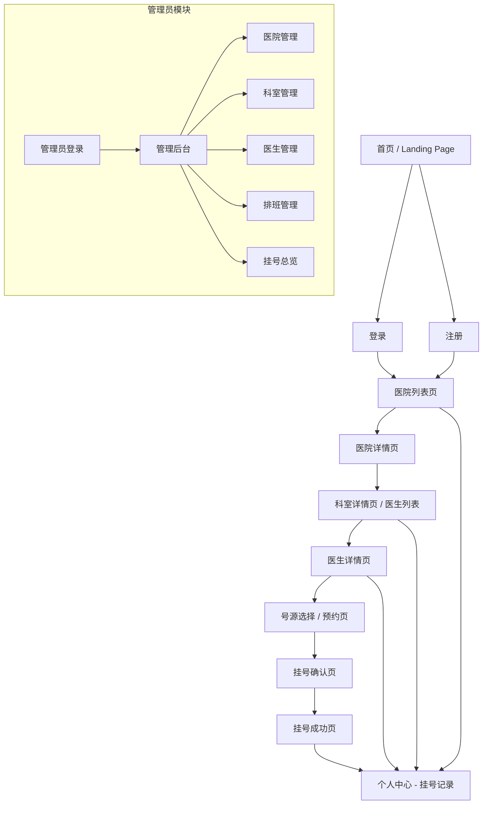
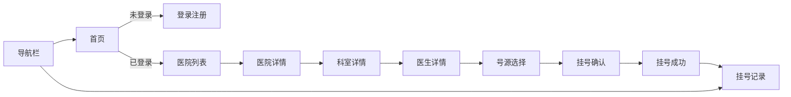

# 医院在线挂号系统 — 产品需求文档（PRD）

## 1. 项目信息

| 字段                  | 内容                                                                                                                                                    |
| --------------------- | ------------------------------------------------------------------------------------------------------------------------------------------------------- |
| **项目名称**          | `hospital_registration`                                                                                                                                 |
| **文档版本**          | v1.0                                                                                                                                                    |
| **产品经理**          | 许清楚 (Alice)                                                                                                                                          |
| **编程语言 / 技术栈** | Next.js 16 + React 19 + TypeScript 6 + Prisma 7 + SQLite + Tailwind CSS 4                                                                               |
| **原始需求**          | 构建一个医院在线挂号网站，患者可通过注册登录，完成浏览医院、选择科室/医生、预约号源、确认挂号、查看挂号记录的全流程。系统支撑面向管理员的后台管理能力。 |

---

## 2. 产品定义

### 2.1 产品目标

1. **降低患者到院排队成本**：通过在线挂号减少现场排队等候时间，提供清晰的号源选择和预约确认流程。
2. **提升医院号源管理效率**：支撑管理员对医院、科室、医生、排班和号源的统一管理，减少人工调度差错。
3. **保障挂号数据一致性**：确保号源在不同用户并发操作下的准确性，避免"一号多挂"。

### 2.2 用户角色

| 角色                   | 描述                                                                   |
| ---------------------- | ---------------------------------------------------------------------- |
| **普通患者 (Patient)** | 注册登录后浏览医院、科室、医生，选择号源并完成挂号，查看个人挂号记录。 |
| **系统管理员 (Admin)** | 管理医院信息、科室信息、医生信息、排班和号源配额。                     |

### 2.3 用户故事

|  ID   | 用户故事                                                                                                    |
| :---: | ----------------------------------------------------------------------------------------------------------- |
|  US1  | 作为 **普通患者**，我希望 **注册/登录账号**，以便 **使用系统的挂号功能**。                                  |
|  US2  | 作为 **普通患者**，我希望 **按地区/等级筛选医院并查看医院详情**，以便 **快速找到目标医院**。                |
|  US3  | 作为 **普通患者**，我希望 **浏览科室和医生列表，查看医生简介和排班**，以便 **选择合适的医生和就诊时间**。   |
|  US4  | 作为 **普通患者**，我希望 **选择号源并提交挂号**，以便 **预约就诊**。                                       |
|  US5  | 作为 **普通患者**，我希望 **查看我的挂号记录和当前挂号状态**，以便 **跟踪就诊安排**。                       |
|  US6  | 作为 **系统管理员**，我希望 **维护医院、科室、医生、排班和号源信息**，以便 **支撑线上挂号业务的正常运行**。 |

---

## 3. 技术规范

### 3.1 需求池（优先级分级）

#### P0 — 必须实现（MVP 核心流程）

| 编号  | 模块       | 需求描述                                                            |
| :---: | ---------- | ------------------------------------------------------------------- |
| P0-1  | 用户体系   | **应** 提供患者注册（手机号/邮箱 + 密码）与登录功能                 |
| P0-2  | 用户体系   | **应** 提供 JWT Session 管理，登录态过期自动跳转                    |
| P0-3  | 医院列表   | **应** 展示所有可挂号医院，支持按地区、等级（三甲/二甲等）筛选      |
| P0-4  | 科室浏览   | **应** 在医院详情页展示科室列表，点击进入科室                       |
| P0-5  | 医生列表   | **应** 在科室下展示医生列表，包括姓名、职称、专长简介               |
| P0-6  | 排班号源   | **应** 展示医生未来 7 天的排班与可预约号源（时段、号类、余量）      |
| P0-7  | 挂号提交   | **应** 支持选择号源 → 填写/确认就诊人信息 → 提交挂号 → 生成挂号记录 |
| P0-8  | 数据一致性 | **应** 通过数据库事务或乐观锁机制防止号源超卖                       |
| P0-9  | 挂号记录   | **应** 提供个人挂号记录列表，包含状态（已挂号/已就诊/已取消）       |
| P0-10 | 管理员后台 | **应** 提供管理员登录入口，管理医院、科室、医生、排班 CRUD          |

#### P1 — 应当实现（体验增强）

| 编号  | 模块       | 需求描述                                                                  |
| :---: | ---------- | ------------------------------------------------------------------------- |
| P1-1  | 挂号流程   | **应当** 支持"就诊人管理"，可维护多个就诊人信息                           |
| P1-2  | 挂号流程   | **应当** 提供挂号确认页（号源信息 + 就诊人 + 费用预览），确认后才扣减号源 |
| P1-3  | 挂号流程   | **应当** 实现取消挂号功能（限定在就诊前 2 小时）                          |
| P1-4  | 搜索       | **应当** 支持按医院名称/医生姓名模糊搜索                                  |
| P1-5  | 通知       | **应当** 挂号成功/取消时给用户发送站内通知                                |
| P1-6  | 管理员后台 | **应当** 支持查看挂号总览（当日挂号量、各科室分布）                       |

#### P2 — 可以支持（远期优化）

| 编号  | 模块     | 需求描述                         |
| :---: | -------- | -------------------------------- |
| P2-1  | 评价     | 可支持挂号完成后对医生进行评价   |
| P2-2  | 支付     | 可支持在线支付挂号费             |
| P2-3  | 消息推送 | 可支持短信/邮件提醒就诊          |
| P2-4  | 数据分析 | 可支持管理员查看挂号趋势统计报表 |

---

### 3.2 UI 设计稿 — 页面结构与流转

#### 3.2.1 页面结构

#### 3.2.2 页面布局说明

| 页面          | 核心 UI 要素                                                                               |
| ------------- | ------------------------------------------------------------------------------------------ |
| **首页**      | 顶部导航（Logo + 搜索框 + 登录/注册入口），主体为医院筛选区（地区/等级下拉）+ 医院卡片列表 |
| **注册/登录** | 表单：手机号/邮箱 + 密码 + 确认密码（注册）/ 忘记密码（登录）                              |
| **医院列表**  | 筛选栏（省份/城市/等级）+ 搜索框 + 医院卡片网格（名称、等级、地址、可挂号数）              |
| **医院详情**  | 医院名称/地址/电话/简介 + 科室列表（可挂号科室卡片，显示科室名 + 医生数）                  |
| **科室详情**  | 科室名 + 医生列表卡片（医生头像/姓名/职称/专长 + "预约挂号"按钮）                          |
| **医生详情**  | 医生简介、专长、职称 + 排班日历（7 天，每天显示时段 + 剩余号数）                           |
| **号源选择**  | 选择日期/时段/号类 → 选择就诊人（已有或新增） → 提交                                       |
| **挂号确认**  | 展示号源信息摘要 + 就诊人信息 + 费用 → 确认提交按钮                                        |
| **挂号成功**  | 成功提示 + 挂号编号 + 就诊提醒 + 查看记录按钮                                              |
| **挂号记录**  | 列表（医院、科室、医生、时间、状态），可筛选状态，可操作取消                               |
| **管理后台**  | 侧边栏菜单 + 内容区 Tab 表（医院/科室/医生/排班 CRUD 表单与列表）                          |

#### 3.2.3 主要页面流转

---

### 3.3 待确认问题（Open Questions）

| 编号  | 问题                                             | 建议方案                                                   |
| :---: | ------------------------------------------------ | ---------------------------------------------------------- |
|  OQ1  | 是否要支持微信/支付宝第三方登录？                | 当前暂不支持，列为 P2 远期考虑                             |
|  OQ2  | 注册是否需要短信验证码验证手机号？               | 建议首次 MVP 暂用"邮箱验证"简化实现，手机验证后续 P1 补充  |
|  OQ3  | 是否支持同一位患者在同一时段挂多个科室号？       | 建议限制同一时段只能挂一个号，后续可讨论放开               |
|  OQ4  | 号源费用数据从何而来？是固定金额还是医生自定义？ | 建议每类号（普通/专家/特需）各医院统一定价，医生级别可加价 |
|  OQ5  | 管理员账号如何初始化？                           | 建议通过 Prisma seed 脚本初始化一个默认管理员账号          |
|  OQ6  | 是否需要考虑 i18n 国际化？                       | 当前仅支持中文，暂不扩展                                   |

---

## 4. 附录

### 4.1 关键数据实体（供架构师参考）

| 实体                        | 核心字段                                                                     |
| --------------------------- | ---------------------------------------------------------------------------- |
| **User (用户)**             | id, name, email/phone, passwordHash, role(patient/admin), createdAt          |
| **Hospital (医院)**         | id, name, address, city, level(三甲/二甲等), phone, description              |
| **Department (科室)**       | id, name, description, hospitalId                                            |
| **Doctor (医生)**           | id, name, title, specialty, introduction, departmentId                       |
| **Schedule (排班)**         | id, doctorId, date, timeSlot(上午/下午/晚), quota, bookedCount               |
| **Registration (挂号记录)** | id, patientId, doctorId, scheduleId, date, timeSlot, type, status, createdAt |
| **PatientProfile (就诊人)** | id, userId, name, idCard, phone, gender                                      |

### 4.2 非功能性需求（建议）

- 挂号事务需使用 Prisma 事务或行级锁，确保并发安全
- 页面首次加载 TTFB < 2s
- 表单提交需有 loading 状态和防重复提交机制
- 响应式设计，移动端和桌面端均可用
